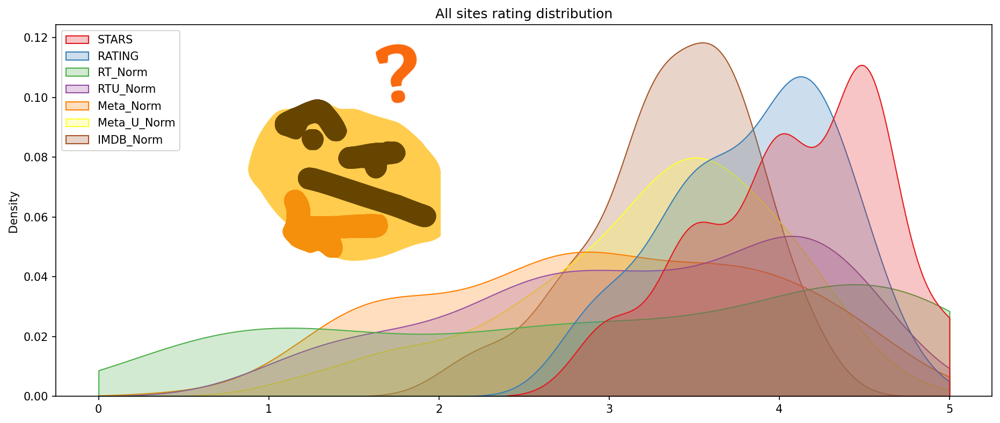

# Fandango Movies Rating Dataset Analysis :popcorn: :movie_camera:

## Used in this project
   

## Overview
When considering watching a movie, how reliable are online reviews and ratings? This is particularly important when the same company responsible for providing ratings also profits from selling movie tickets. Could their assessments be influenced by a bias towards higher ratings than the movies truly deserve?

## Understanding the Background and Data
**Article: [Be Suspicious Of Online Movie Ratings, Especially Fandango’s](http://fivethirtyeight.com/features/fandango-movies-ratings/)**

## Goal
The purpose of this project is to perform an exploratory analysis of data from datasets obtained from different websites that provide movie critiques and reviews. To achieve this, we will analyze the data distribution by examining graphs and, ultimately, determine if the website exhibited any bias when assigning ratings to the films.
